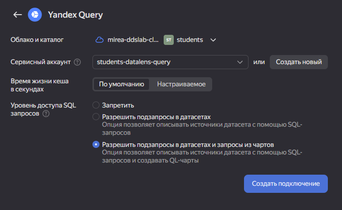
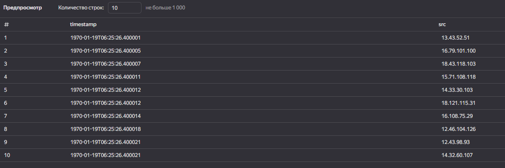
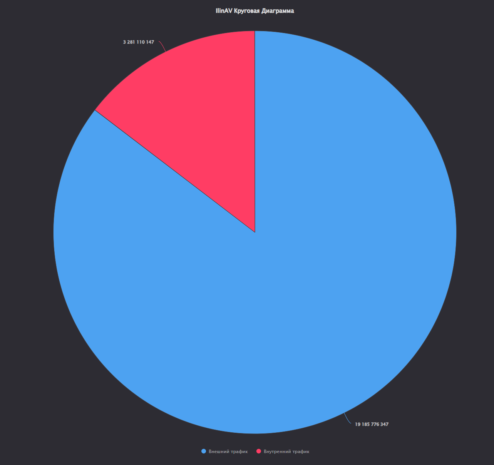
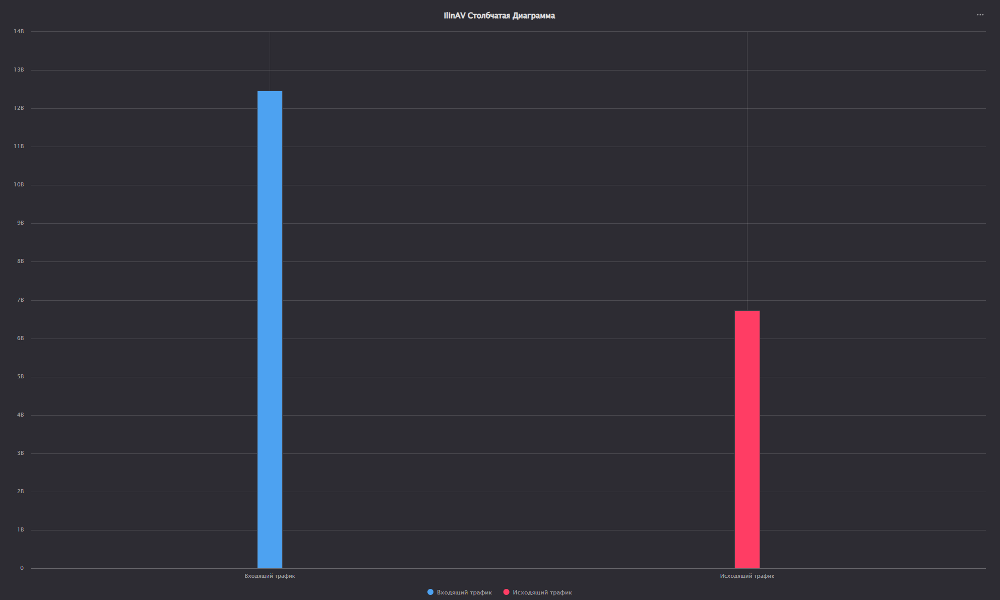
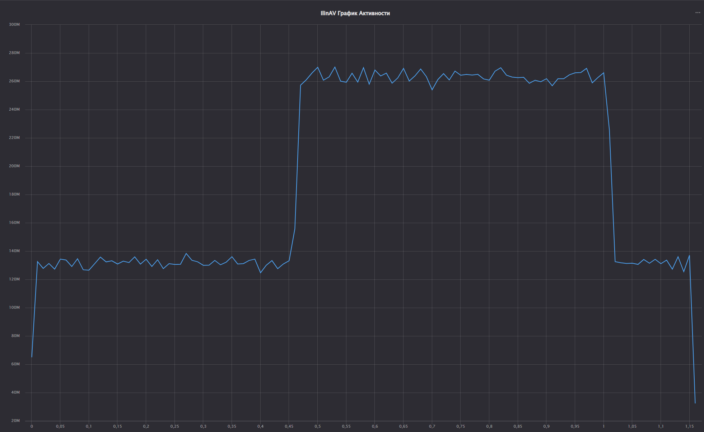
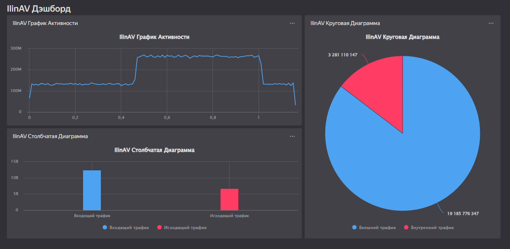

# Использование технологии Yandex Query DataLens для анализа данных сетевой активности

## Цель работы

1. Изучить возможности технологии Yandex Query для визуального анализа структурированных наборов данных
2. Получить навыки визуализации данных для последующего анализа с помощью сервисов Yandex Cloud
3. Получить навыки создания решений мониторинга/SIEM на базе облачных продуктов и открытых программных решений
4. Закрепить практические навыки использования SQL для анализа данных сетевой активности в сегментированной корпоративной сети

## Исходные данные

1. Браузер Chrome
2. Yandex Cloud Organization

## План

1. Представить в виде круговой диаграммы соотношение внешнего и внутреннего сетевого трафика.
2. Представить в виде столбчатой диаграммы соотношение входящего и исходящего трафика из внутреннего сетвого сегмента.
3. Построить график активности (линейная диаграмма) объема трафика во времени.
4. Все построенные графики вывести в виде единого дашборда в Yandex DataLens.

## Шаги

### 1. Подключение Yandex Query используя DataLens



### 2. Создать датасет DataLens
 

 
### 3. Строим графики и диаграммы


a) Представить в виде круговой диаграммы соотношение внешнего и внутреннего
 сетевого трафика.

Запрос:
```r
IF  (
        ([dst] LIKE '12.%' OR [dst] LIKE '13.%' OR [dst] LIKE '14.%') 
        AND 
        ([src] LIKE '12.%' OR [src] LIKE '13.%' OR [src] LIKE '14.%')
    )
        THEN "Внутренний трафик" 
    ELSE "Внешний трафик" 
END
```
Получившийся чарт:



b) Представить в виде столбчатой диаграммы соотношение входящего и
исходящего трафика из внутреннего сетвого сегмента.
 
Запрос:
```r
IF  (
        ([src] LIKE '12.%' OR [src] LIKE '13.%' OR [src] LIKE '14.%') 
        AND 
        ([dst] not LIKE '12.%' and [dst] not LIKE '13.%' and [dst] NOT LIKE '14.%')
    )
        THEN "Исходящий трафик"
ELSEIF (
        ([dst] LIKE '12.%' OR [dst] LIKE '13.%' OR [dst] LIKE '14.%') 
        AND 
        ([src] NOT LIKE '12.%' AND [src] NOT LIKE '13.%' AND [src] NOT LIKE '14.%')
    )
        THEN "Входящий трафик"
END
```

Получивишйся чарт:



 c) Построить график активности (линейная диаграмма) объема трафика во
 времени.

Запрос:
```r
ROUND(([timestamp] - DATETRUNC([timestamp], "second")) * 100000,2)
```

Получившийся чарт:



d) Все построенные графики вывести в виде единого дашборда в Yandex DataLens.




## Оценка результата

В результате работы были построены графики и выведены ввиде дашборда.

## Вывод

Были изучены возможности технологии Yandex Query для визуального анализа структурированных наборов данных и закреплены практические навыки использования SQL для анализа данных сетевой активности в сегментированной корпоративной сети.